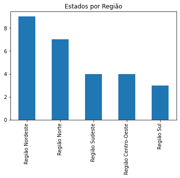

# Básico de Pandas

## O que é o Pandas?

> _[Pandas](https://pandas.pydata.org) é uma biblioteca Python criada para `manipulação` e `análise` em um `conjunto` de dados `estruturados`._

Pandas é uma das portas de entrada para os mundos dos dados devido a sua facilidade de uso e aprendizagem. Pandas é open-source e de uso gratuito, sob uma licença BSD.

Pandas é uma ferramenta de processamento de dados de `alto desempenho`, com recursos flexíveis de `manipulação de planilhas` e de `banco de dados relacionais`.

Pandas pode trabalhar com _"Dados tabulares, como uma planilha Excel ou uma tabela SQL, dados ordenados de modo temporal ou não, matrizes e qualquer outro conjunto de dados, que não necessariamente precisem estar rotulados"._

Pandas é ideal para análises exploratórias de dados, permitindo `leitura`, `manipulação`, `agregação` e `plotagem` dos dados em poucos passos.

Existem dois tipos de estrutura de dados no `pandas`, `séries` e `data frames`, que serão abordados a seguir.

Algumas [vantagens](https://harve.com.br/blog/programacao-python-blog/pandas-python-vantagens-e-como-comecar/) do `Pandas`:

* Suporte para alinhamento automático ou explícito dos dados.
* Tratamento flexível e simplificado de dados ausentes.
* Uso de operações.
* Combinações e operações relacionais.
* Informações estatísticas.
* Séries temporais.
* Visualização de dados.

Caso queria seguir um tutorial passo-a-passo dê uma olhada no site da [W3 Schools](https://www.w3schools.com/python/pandas/default.asp).

Caso queira verificar a documentação da própria biblioteca, execute:

```python
help('pandas')
# Resultado:
# Help on package pandas:

# NAME
#     pandas

# DESCRIPTION
#     pandas - a powerful data analysis and manipulation library for Python
#     =====================================================================

#     **pandas** is a Python package providing fast, flexible, and expressive data
#     ...
```

## Instalação do Pandas

Atualmente `Pandas` possui suporte oficial para Python `3.8`, `3.9` and `3.10`.

Para utilizar o `Pandas` rapidamente basta instalar a biblioteca via `pip`:

```python
pip install pandas
```

Para mais instruções de instalação na [página oficial](https://pandas.pydata.org/docs/getting_started/install.html).

## Instalação do NumPy

> NumPy é uma biblioteca para a linguagem de programação Python, que suporta o processamento de grandes, multi-dimensionais arranjos e matrizes, juntamente com uma grande coleção de funções matemáticas de alto nível para operar sobre estas matrizes. [Wikipedia](https://pt.wikipedia.org/wiki/NumPy)_

NumPy fornece um objeto de `matriz` (array) que é até `50` vezes mais `rápido` que as `listas` tradicionais do Python. Isso é muito importante quando trabalhamos com grandes volumes de dados.

A biblioteca `NumPy` já é instalada com o `Pandas`.

## Series

Um das estruturas de dados do `Pandas` são as `Séries`.

Séries são comparados a `tabelas` simples ou `arrays unidimensionais`, ou ainda uma `lista` simples do Python.

As `séries` podem armazenar dados de qualquer tipo (`inteiro`, `string`, `float`, `objetos python`, etc.).

A estrutura básica de uma `série` pode ser visualizada a abaixo:

```
    | Valor |
| Í |       |
| n |       |
| d |       | Linhas
| i |       |
| c |       |
| e |       |
```

Exemplo:

```
| Índice  | Idade |
| 0       |   36  |
| 1       |   29  |
| 2       |   60  |
| 3       |   61  |
| 4       |   82  |
| 5       |   93  |
```

A seguir temos um exemplo de uma `série` do `Pandas`:

```python
# -*- coding: utf-8 -*-

import pandas as pd

idades_dos_alunos = pd.Series([36, 29, 60, 61])

print(idades_dos_alunos.values)
# Resultado: array([36, 29, 60, 61])

print(idade_dos_alunos)
# Resultado:
# 0 36
# 1 29
# 2 60
# 3 61
# dtype: int64
```

O código acima cria um objeto `Série` do `Pandas`, contendo as idades dos alunos de uma turma.

Como é possível observar ao imprimir todo o objeto no último `print`, o `Pandas` criou um `índice` ou uma `label (rótulo)` específico com inteiros positivos crescentes para nossa `série`, iniciando do número `0` até o número `3`. Isso ocorre por que não informamos `nomes`, `valores` ou `chaves` específicas para nossa série.

```python
idades_dos_alunos = pd.Series([36, 29, 60, 61], index=['Eduardo', 'Heline', 'Cristina', 'Luiz'])

print(idade_dos_alunos)
# Resultado:
# Eduardo   36
# Heline    29
# Cristina  60
# Luiz      61
# dtype: int64
```

O código acima cria uma `série` com índices `nomeados`. Isso facilita o trabalho quando queremos recuperar algum valor da `série`:

```python
# imprime a idade do aluno Eduardo
print(idade_dos_alunos['Eduardo'])
# Resultado: 36
```

Também pode criar uma `série` a partir de um `dicionário` do Python:

```python
idades = {'Eduardo': 36, 'Heline': 29, 'Cristina': 60, 'Luiz': 61}

idades_dos_alunos = pd.Series(idades)

print(idade_dos_alunos)
# Resultado:
# Eduardo   36
# Heline    29
# Cristina  60
# Luiz      61
# dtype: int64
```

Também pode criar uma `série` a partir de um objeto do `NumPy`:

```python
# -*- coding: utf-8 -*-

# cria um numpy.array unidimensional com números pares de 0 a 1000
array_par = np.arange(0, 1001, 2, int)

# crian a serie (serie_par) a partir do array (array_par)
serie_par = pd.Series(array_par)

# imprime as primeiras 5 linhas da série
print(serie_par.head())
# Resultado:
# 0    0
# 1    2
# 2    4
# 3    6
# 4    8
# dtype: int32
```

A partir do objeto `série`, podemos executar algumas operações sobre os dados:

```python
idades_dos_alunos = pd.Series([36, 29, 60, 61], index=['Eduardo', 'Heline', 'Cristina', 'Luiz'])

# imprime a média das idades
print("Média:", idades_dos_alunos.mean())
# Resultado: Média: 46.5

# imprime o desvio padrão das idades
print("Desvio padrão:", idades_dos_alunos.std())
# Resultado: Desvio padrão: 16.421530582338136

# resume brevemente as estatísticas dos dados
print(idades_dos_alunos.describe())
# Resultado:
# count     4.000000
# mean     46.500000
# std      16.421531
# min      29.000000
# 25%      34.250000
# 50%      48.000000
# 75%      60.250000
# max      61.000000
# dtype: float64

# soma mais um ano de vida com expressão do numpy
print(idades_dos_alunos + 1)
# Resultado:
# Eduardo   37
# Heline    30
# Cristina  61
# Luiz      62
# dtype: int64

# eleva ao quadrado com expressão do numpy
print(idades_dos_alunos ** 2)
# Resultado:
# Eduardo     1296
# Heline       841
# Cristina    3600
# Luiz        3721
# dtype: int64
```

## Testando o código com ambiente interativo

Caso queira testar os códigos acima com um ambiente de desenvolvimento mais interativo, veja a seção [Instalação e Configuração do Jupyter](./instalacao-configuracao-jupyter.md).


## Dataframe

Um `DataFrame (quadro de dados)` é uma estrutura de dados `bidimensional` comparado a uma `planilha de excel` ou `tabela do banco de dados`, composto por `colunas`, `linhas` e um `índice`.

Toda `arquivo` lido pelo `Pandas` torna-se um `DataFrame` por padrão.

Abaixo é mostrado um diagrama com a estrugura de uma `DataFrame`:

```
    |            Colunas                 |
    | Coluna A | Coluna B | Coluna N ... |
| Í |          |          |              |
| n |          |          |              |
| d |          |          |              | Linhas
| i |          |          |              |
| c |          |          |              |
| e |          |          |              |
```

### Leitura de Dados

Assim como no objeto `série`, podemos criar um `DataFrame` a partir de um `dicionário`de dados:

```python
# -*- coding: utf-8 -*-

import pandas as pd

alunos = {
    'nomes': [],
    'faltas': [],
    'notas': []
}

alunos_dataframe = pd.DataFrame(alunos)

# imprime o dataframe de alunos
print(alunos_dataframe)
# Resultado:
#       nomes  faltas  notas
# 0   Eduardo       2    9.0
# 1    Heline       1    8.5
# 2  Cristina       0    7.0
# 3      Luiz       3    6.0
```

Veja o mesmo resultado executado no `Jupyter Notebook`:


Também podemos usar métodos já existentes do `Pandas` para realizar a leitura de arquivos ou fontes de dados.

Para ler um arquivo `.csv` basta executar:

```python
# -*- coding: utf-8 -*-

# captura o caminho do arquivo de dados
base_path = os.path.dirname(os.path.abspath(__file__))
file_path = os.path.join(base_path, 'data', 'brasil-estados.csv')

# realiza leitura do arquivo CSV
estados_dataframe = pd.read_csv(file_path, header=0, sep=';')

# imprime um DataFrame com as colunas ESTADO e UF
print(estados_dataframe[['Estado', 'UF']])
# Resultado:
#                  Estado  UF
# 0              Rondônia  RO
# 1                  Acre  AC
# 2              Amazonas  AM
# 3               Roraima  RR
# 4                  Pará  PA
# 5                 Amapá  AP
# 6             Tocantins  TO
# 7              Maranhão  MA
# 8                 Piauí  PI
# 9                 Ceará  CE
# 10  Rio Grande do Norte  RN
# 11              Paraíba  PB
# 12           Pernambuco  PE
# 13              Alagoas  AL
# 14              Sergipe  SE
# 15                Bahia  BA
# 16         Minas Gerais  MG
# 17       Espírito Santo  ES
# 18       Rio de Janeiro  RJ
# 19            São Paulo  SP
# 20               Paraná  PR
# 21       Santa Catarina  SC
# 22    Rio Grande do Sul  RS
# 23   Mato Grosso do Sul  MS
# 24          Mato Grosso  MT
# 25                Goiás  GO
# 26     Distrito Federal  DF
```

A seguir são apresentados alguns comandos básicos para `leitura` de dados em um `DataFrame`:

```python
# -*- coding: utf-8 -*-

# imprime apenas as primeiras linhas do DataFrame
print(estados_dataframe.head())
# Resultado:
#   IBGE    Estado  UF        Região  Qtd Mun
# 0    11  Rondônia  RO  Região Norte       52
# 1    12      Acre  AC  Região Norte       22
# 2    13  Amazonas  AM  Região Norte       62
# 3    14   Roraima  RR  Região Norte       15
# 4    15      Pará  PA  Região Norte      144


# imprime as últimas linhas do dataframe
print(estados_dataframe.tail())
# Resultado:
#     IBGE              Estado  UF               Região  Qtd Mun
# 22    43   Rio Grande do Sul  RS           Região Sul      497
# 23    50  Mato Grosso do Sul  MS  Região Centro-Oeste       79
# 24    51         Mato Grosso  MT  Região Centro-Oeste      141
# 25    52               Goiás  GO  Região Centro-Oeste      246
# 26    53    Distrito Federal  DF  Região Centro-Oeste        1


```


### Manipulação de Dados

A seguir são apresentados alguns comandos básicos para `manipulação` de dados em um `DataFrame`:

```python
# -*- coding: utf-8 -*-

...

# cria o dataframe a partir do dicionário de alunos
alunos_dataframe = pd.DataFrame(alunos)

# imprime as colunas e os tipos de dados identificados
print(alunos_dataframe.dtypes)
# Resultado:
# nomes      object
# faltas      int64
# notas     float64
# dtype: object


# imprime a lista de colunas do dataframe
print(alunos_dataframe.columns)
# Resultado:
# Index(['nomes', 'faltas', 'notas'], dtype='object')


# imprime a quantidade de linhas e colunas
print(alunos_dataframe.shape)
# Resultado:
# (4, 3)


# imprime informações do dataframe
print(alunos_dataframe.info())
# Resultado
# <class 'pandas.core.frame.DataFrame'>
# RangeIndex: 4 entries, 0 to 3
# Data columns (total 3 columns):
#  #   Column  Non-Null Count  Dtype
# ---  ------  --------------  -----
#  0   nomes   4 non-null      object
#  1   faltas  4 non-null      int64
#  2   notas   4 non-null      float64
# dtypes: float64(1), int64(1), object(1)
# memory usage: 224.0+ bytes


# imprime os valores de uma única coluna
print(alunos_dataframe['nomes'])
# Resultado:
# 0     Eduardo
# 1      Heline
# 2    Cristina
# 3        Luiz
# Name: nomes, dtype: object


# imprime estatísticas do dataframe do forma resumida
print(alunos_dataframe.describe())
# Resultado:
#          faltas     notas
# count  4.000000  4.000000
# mean   1.500000  7.625000
# std    1.290994  1.376893
# min    0.000000  6.000000
# 25%    0.750000  6.750000
# 50%    1.500000  7.750000
# 75%    2.250000  8.625000
# max    3.000000  9.000000


# imprime o dataframe ordenado por uma das colunas
print(alunos_dataframe.sort_values(by="nome"))
# Resultado:
#       nomes  faltas  notas
# 2  Cristina       0    7.0
# 0   Eduardo       2    9.0
# 1    Heline       1    8.5
# 3      Luiz       3    6.0


# imprime um item do dataframe localizando este a partir do seu índice
print(alunos_dataframe.loc[3])
# Resultado:
# nomes     Luiz
# faltas       3
# notas      6.0
# Name: 3, dtype: object

# imprime somente os registros que atendam a uma condição
print(alunos_dataframe[alunos_dataframe['notas'] == 9])
# Resultado:
#      nomes  faltas  notas
# 0  Eduardo       2    9.0


# imprime somente os registros que atendam a mais de uma condição
print(alunos_dataframe[alunos_dataframe['notas'] == 9 & alunos_dataframe['faltas'] == 2])
# Resultado:
#      nomes  faltas  notas
# 0  Eduardo       2    9.0
```

Uma observação para o método `sort_values` é que este `não` modifica o `dataframe` original, apenas a visualização deste no momento do comando.

Outro aspecto a ser o observado é que ao utilizar expressões de `indexação boleanda (Boolean Indexing)` para filtrar os registros baseado em condições, devemos usar `operadores bitwise`, sendo:
* **& (e comercial)**: `and`
* **| (pipe)**: `or`
* **~ (til)**: `not`

Verifique [este](https://medium.com/data-hackers/uma-introdução-simples-ao-pandas-1e15eea37fa1) e [este](https://medium.com/tech-grupozap/introdução-a-biblioteca-pandas-89fa8ed4fa38) artigo para mais `métodos` de manipulação de dados.

Após manipular os dados, caso queira salver o seu `dataframe` para um arquivo basta executar:

```python
alunas_dataframe.to_csv("alunos.csv")
```

## Visualização de Dados

Com o `Pandas` é possível utilizar gráficos para visualizar os dados facilmente através de biblioteca `matplotlib`.

Para instalar a biblioteca basta executar:

```python
pip install matplotlib
```

Com a biblioteca instalada podemos iniciar a visualização dos dados:

```python
# imprime um gráfico com os estados dividos em regiões do país
estados_dataframe["Região"].value_counts().plot.bar(title='Estados por Região')
estados_dataframe["Região"].value_counts().plot.pie(title='Estados por Região')
```




## Blibiotecas complementares

A seguir alguns bibliotecas auxiliares que valem a pena dar uma olhada:

* [Seaborn](https://seaborn.pydata.org/): Estatística e visualizações.
* [NumPy](https://numpy.org/): Bibliotecas para funções matemáticas.
* [Matplotlib](https://matplotlib.org/): Visualizações de dados.
* [Scikit-Learn](https://scikit-learn.org/): Classificação, clusterização e regressão.

## Help para os recém chegados

Para você que já programa em `R`, `SQL` e outras liguagens, consulte esse material para veerificar comandos correspondentes no `Pandas`: [Comparison with other tools](https://pandas.pydata.org/pandas-docs/stable/getting_started/comparison/index.html).

## Referências

* https://pandas.pydata.org
* https://pt.wikipedia.org/wiki/Pandas_(software)
* http://blog.mds.gov.br/redesuas/lista-de-municipios-brasileiros/
* https://medium.com/data-hackers/uma-introdução-simples-ao-pandas-1e15eea37fa1
* https://www.w3schools.com/python/pandas/default.asp
* https://pt.wikipedia.org/wiki/NumPy
* https://www.codingame.com/playgrounds/52723/programacao-python-parte-3---prof--marco-vaz/pacote-pandas-series
* https://medium.com/tech-grupozap/introdução-a-biblioteca-pandas-89fa8ed4fa38
* https://harve.com.br/blog/programacao-python-blog/pandas-python-vantagens-e-como-comecar/
* https://medium.com/tech-grupozap/introdução-a-biblioteca-pandas-89fa8ed4fa38
