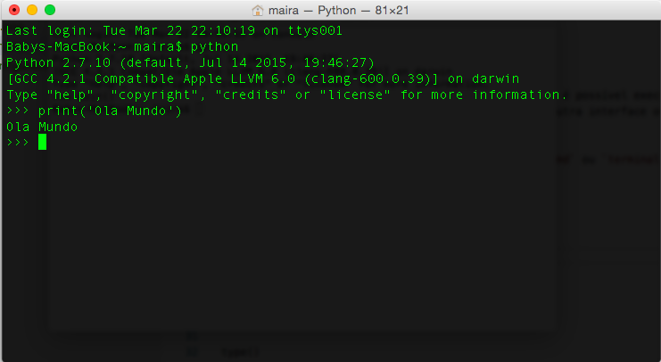

# Básico do Python

> _<br>Python é uma linguage de programação de propósito geral.<br><br>_

Um de suas principais características é a facilidade de `escrita` e `leitura` do código. Python engaja todos os tipos de desenvolvedores, experientes ou não, sendo atualmente a principal porta de entrada para recém chegados no mundo da programação.

Possui as seguintes características:

* [Alto Nível](https://pt.wikipedia.org/wiki/Linguagem_de_programa%C3%A7%C3%A3o_de_alto_n%C3%ADvel)
* Interpretada de Script
* Tipagem Dinâmica e Forte
* Multiparadigma
  * Imperativa
  * Funcional
  * Procedural
  * Orientada à Objetos

## Linha de Comando

Como o Python é uma linguagem `interpretada de script` é possível executar comandos Python diretamente em uma linha de comando, sem necessidae de nenhuma outra interface ou processo de `build`  ou ` compilação`.

Para acesasr o `shell` do `Python` basta abrir um `cmd` ou `terminal` e digitar o comando:

``` shell
python
```

Será aberto o `shell` do Python conforme imagem abaixo:



Na imagem acima é possível visualizar o `shell` do Python e nele excutamos o comando `print('Ola Mundo')` para exemplificar a utilização deste.

## Variáveis

> <br>_Variável é um `espaço` reservado na memória do computador capaz de armazenar um determinado `valor`.<br><br>_

Este `valor` pode ser algo discreto como um `nome (Eduardo)` ou um `número (36)`. Estes valores são descritos como [tipos primitivos](https://en.wikipedia.org/wiki/Primitive_data_type), que são _"um conjunto de tipos de dados básicos a partir dos quais todos os outros tipos de dados são construídos"_.

Uma `variável` também pode armazenar `objetos complexos (uma classe que representa uma pessoa)` ou até mesmo `funções (métodos executáveis da linguagem de programação)`. Estes valores são descritos como [tipos compostos ou derivados](https://en.wikipedia.org/wiki/Composite_data_type), que é _"qualquer tipo de dados que pode ser construído em um programa usando os tipos de dados primitivos da linguagem de programação"_.

Customo dizer que as `variáveis` dão vida aos programas, pois são através delas que `manipulamos` as informações do `sistema de informações`. Sacou?!

Cada espaço reservado na memória, ou seja, uma `variável`, está associada a um `nome` que identifica únicamente esta variável no escopo do programa. Não é possível ter duas variáveis com o mesmo nome, dentro do mesmo escopo.

Uma variável, somente existe em `tempo de execução`, ou seja, quando o programa está `executando` ou `"rodando"`.

Existem vários padrões para `nomear` uma variável, e cada linguagem de programação normalmente estabelece um padrão que pode ser seguido pelos desenvolvedores. No caso do Python o padrão mais adotado é o estabelecido na [PEP 8](https://peps.python.org/pep-0008/#prescriptive-naming-conventions) e segue de forma geral as seguintes regras para nomeação de veriáveis:

* Utilizar nomes com letras minúsculas
* Utilizar o caractere `_ (underline)` como separados entre as palavras

Lembrando que Python é `case sensivite`, ou seja, a variável `pessoa` é diferente da varíavel `Pessoa`.

O Python possui um jeito peculiar de criar ou `declarar` uma variável. Diferente de outras linguagens de `tipagem estática`, para declarar uma variável no Python, basta apenas informar o `nome` da variável, `inicializando` ela com algum valor, conforme demonstrado abaixo:

```python
nome_pessoa = 'Eduardo'
```

Caso a variável ainda não exista em memória o `interpretador` Python irá criá-la. Caso a variável já exista em memória, o valor desta será atualizada.

```python
print(nome_pessoa)

# Resultado: Eduardo
```

Perceba que no código acima, em nenhum momento especificamos o `tipo` da variáel. Isso ocorre por que Python é uma linguagem de tipagem dinâmica, ou seja, o tipo da variável é determinado em `tempo de execução` no momento que algum valor é atribuído a ela.

Para verificar o `tipo` de uma variável, basta usar o comando a seguir:

```python
type(nome_pessoa)

# Resultado: <class 'str'>
```

O Python trata todas as variáveis como um `objeto` em memória. Um `objeto` contém `propriedades` e `métodos` que podem ser `explorados` pelo desenvolvedor.

Para verificar quais `propriedades` e `métodos` um `objeto` possui, basta usar o comando abaixo:

```python
dir(nome_pessoa)

# Resultado: ['__add__', '__class__', '__contains__', '__delattr__', '__dir__', '__doc__', '__eq__', '__format__', '__ge__', '__getattribute__', '__getitem__', '__getnewargs__', '__gt__', '__hash__', '__init__', '__init_subclass__', '__iter__', '__le__', '__len__', '__lt__', '__mod__', '__mul__', '__ne__', '__new__', '__reduce__', '__reduce_ex__', '__repr__', '__rmod__', '__rmul__', '__setattr__', '__sizeof__', '__str__', '__subclasshook__', 'capitalize', 'casefold', 'center', 'count', 'encode', 'endswith', 'expandtabs', 'find', 'format', 'format_map', 'index', 'isalnum', 'isalpha', 'isascii', 'isdecimal', 'isdigit', 'isidentifier', 'islower', 'isnumeric', 'isprintable', 'isspace', 'istitle', 'isupper', 'join', 'ljust', 'lower', 'lstrip', 'maketrans', 'partition', 'replace', 'rfind', 'rindex', 'rjust', 'rpartition', 'rsplit', 'rstrip', 'split', 'splitlines', 'startswith', 'strip', 'swapcase', 'title', 'translate', 'upper', 'zfill']
```
As `propriedades` e `métodos` listados acima, podem ser utilizados pelo desenvedor. Por exemplo:

```shell
print(nome_pessoa.isnumeric())

# Resultado: False
```

## Tipos de Variáveis

Python suporta `4` diferentes tipos `numéricos`:

* int (signed integers)
* long (long integers, they can also be represented in octal and hexadecimal)
* float (floating point real values)
* complex (complex numbers)

Outro tipo bastante utilizado no Python é o tipo `str`, que representa uma `string` ou `texto`, podendo conter tanto caracteres alfanuméricos, como também números e símbolos.

Além disso, temos outros tipos que armazenam estruturas de dados como:

* List
* Set
* Tuple
* Dictionary

Estes últimos serão mencionados melhor logo abaixo.

## Operadores

Operadores em linguagem de programação são `símbolos` especiais que executam alguma `operação` especial durante a execução do programa, por exemplo:

* **`+`** : Realiza operações de `soma` entre dois objetos/variáveis `numéricas` ou `concatenação` entre das variáveis do tipo `texto`.
* **`-`** : Realiza operações de `subtração`.
* **`*`** : Realiza operações de `multiplicação`.
* **`/`** : Realiza operações de `divisão`.
* **`== >= <= > <`** : Realiza operações de `comparação`.
* **`=`** : Realiza operações de `atribuição` de valores para `objetos` e `variáveis`.

Exemplos:

```shell
# atribuição
x = 2
y = 2

# soma
print(x + y)
# Resultado: 4

# subtração
print(x - y)
# Resultado: 0

# multiplicação
print(x * y)
# Resultado: 4

# divisão
print(x / y)
# Resultado: 1

# comparação de igualdade
print(x == y)
# Resultado: True

# comparação de maior
print(x > y)
# Resultado: False

# comparação de menor
print(x < y)
# Resultado: False

# comparação de maior ou igual
print(x >= y)
# Resultado: True

# comparação de menor ou igual
print(x <= y)
# Resultado: True
```

## Palavras Reservadas

São palavras especiais reservadas e utilizadas pelo `interpretador` Python para acessar algum comando próprio da linguagem. Estas palavras jamais devem ser usadas para `nomear` variáveis, funções, módulos, classes ou objetos.

São elas:

```
and, as, assert, break, class, continue, def, del, elif, else, except, False, finally,
for, from, global, if, import, in, is, lambda, None, nonlocal, not, or, pass, raise,
return, True, try, while, with, yield
```

## Módulos (Modules)

Um `módulo` nada mais é do que um `arquivo` contendo `comandos` do Python que serão executados pelo seu interpretador.

Como dito anteriormente, Python é uma linguagem `interpretada de script`, ou seja, não existe uma etapa de `compilação` prévia como outras linguagens (C#, por exemplo).

O código Python é `interpretado` em tempo de execução. O código é `lido` e `executado` de forma sequencial, por isso é chamado de script.

Os programas python são compostos por diversos módulos.

Cada módulo pode conter tanto `instruções executáveis` quanto definições de `funções` e `classes`.

A seguir é exibido um `arquivo (módulo)` Python `matematica.py`:

```python
# -*- coding: utf-8 -*-

import math


def fatorial(x):
    return math.factorial(x)

def soma(x, y):
    return x + y
```

Acima é exibido o arquivo `matematica.py` contendo a definição de duas `funções`: `fatorial` e `soma`.

A primeira linha `# -*- coding: utf-8 -*-` seta a codificação padrão do arquivo, permitindo a inserção de caracteres especiais como `acentos` nos comentários do código.

É importante observar que `módulos` Python podem ser reaproveitados, assim o desenvolvedor não precisa re-escrever ou duplicar código.

Para isso, basta realizar a importação de um `módulo` já existente, conforme demonstrado na instrução `import math` do arquivo acima.

Existem diversos `módulos` Python disponíveis. Alguns desses `módulos` são disponibilizados pela própria biblioteca padrão do Python. Outros `módulos` são criados pela `comunidade` e distribuídos livremente na web. Além disso, você pode criar seus próprios `módulos` e importá-los no seu programa Python.

Caso querira ver a documentação de algum módulo específico, execute o comando `help('nome_do_modulo')`:

```python
help('math')
# Resultado:
# Help on module math:

# NAME
#     math

# FILE
#     /System/Library/Frameworks/Python.framework/Versions/2.7/lib/python2.7/lib-dynload/math.so

# MODULE DOCS
#     https://docs.python.org/library/math

# DESCRIPTION
#     This module is always available.  It provides access to the
#     mathematical functions defined by the C standard.

# FUNCTIONS
#     acos(...)
#         acos(x)

#         Return the arc cosine (measured in radians) of x.
````

## Pacotes (Packages)

Um `pacote` Python nada mais é do que um `conjunto` de `módulos` Python. Os pacotes servem para deixar o projeto mais `organizado`.

Para criar um `pacote` Python, basta criar um `diretório` contendo um arquivo chamado `__init__.py` dentro dele. Sempre que o `interpretador` Python localizar um arquivo `__init__.py` dentro de uma pasta, este saberá que ali existe um `pacote`. Nada precisa ser escrito dentro do arquivo `__init__.py`.

Assim como os `módulos` um `pacote` Python também pode ser importados. Por exemplo:

```python
from os import path

print(path.isdir('C:\Windows')
```

O código acima, realiza a importação do módulo `path` a partir do pacote `os`.

Caso queria o desenvolvedor também pode importar todo o `pacote`, como demonstrado a seguir:

```python
import os

print(os.path.isdir('C:\Windows')
```

O código acima, importa o pacote `os`. Dessa forma, todos os `módulos` disponíveis no pacote `os` ficarão acessíveis no escopo atual.

Você também pode criar `"subpacotes"` (`pacotes` dentro de `pacotes`), basta que para cada subpasta exista um arquivo `__init__.py`. Exemplo: 

```
pacoteA
|_ __init__.py
|_ moduloA.py
|_ pacoteB
   |_ __init__.py
   |_ moduloB.py
   |_ pacoteC
      |_ __init__.py
	  |_ moduloC.py
```

Lembrando que para importar o último módulo da árvore (`moduloC.py`), é necessário que todos os diretórios acima deste também sejam `pacotes`, ou seja, possuam um arquivo `__init__.py`.

## Estruturas de dados

> _<br>Uma estrutura de dados (ED), em ciência da computação, é uma coleção tanto de valores (e seus relacionamentos) quanto de operações (sobre os valores e estruturas decorrentes). [Wikipédia](https://pt.wikipedia.org/wiki/Estrutura_de_dados)<br><br>_

Para o nosso cenário atual, vamos considerar uma estrutura de dados simplesmente como uma coleção ou conjunto de valores.

Digamos que antes de ir ao supermercado nosso usuário irá criar algumas listas de compras:

* **Lista 1**: banana, maça e abacaxi.
* **Lista 2**: carne, frango e peixe
* **Lista 3**: biscoito, pipoca e chocolate

Como fazermos para representar estas diferentes listas em nosso programa? Justamente através das `estruturas de dados`.

Nossa `estrutura de dados` podem ser vista de maneira mais simplificada, como `variáveis` ou `objetos` que são capazes de armazenar `um` ou `mais` valores ao mesmo tempo.

No Python, as principais estruturas são:

* `Listas`: listas mutáveis, que podem ser alteráveis
  * Também conhecida como `arrays`
* `Sets`: conjuntos parcialmente mutáveis, que podem ser alterados
* `Dicionários`: conjunto mutável, que pode ser alterado, formado por pares de `chave` e `valor`
* `Tuplas`: listas imutáveis, que não podem ser alteradas

Cada `estruturas de dados` resolve um tipo de problema diferente e podem ser úteis em diversas situações. _É importante conhecer bem cada um desses tipos, utilizando-os da maneira correta nas situações adequadas._

### Listas

Uma lista é a estrutura de dados mais básica do Python e armazena os dados em sequência, onde cada elemento possui sua posição na lista, denominada de índice. O primeiro elemento é sempre o índice zero e a cada elemento inserido na lista esse valor é incrementado. No Python, uma lista pode armazenar qualquer tipo de dado primitivo (string, inteiro, float, etc) ([Treinaweb](https://www.treinaweb.com.br/blog/principais-estruturas-de-dados-no-python)).

```python
lista1 = ['banana', 'maça', 'abacaxi']
print(lista1)
# Resultado: ['banana', 'maça', 'abacaxi']

lista2 = ['Carne', 'frango', 'peixe']
print(lista2)
# Resultado ['Carne', 'frango', 'peixe']

lista3 = ['Biscoito', 'pipoca', 'chocolate']
print(lista3)
# Resultado: ['Biscoito', 'pipoca', 'chocolate']
```

### Sets

No Python, os sets são uma coleção de itens desordenada, parcialmente imutável e que não podem conter elementos duplicados. Por ser parcialmente imutável, os sets possuem permissão de adição e remoção de elementos. Além disso, os sets são utilizados, normalmente, com operações matemáticas de união, interseção e diferença simétrica, conforme veremos nos próximos tópicos ([Treinaweb](https://www.treinaweb.com.br/blog/principais-estruturas-de-dados-no-python)).

```python
conjunto1 = {'banana', 'maça', 'abacaxi'}
# ou
conjunto1 = set(['banana', 'maça', 'abacaxi'])
print(conjunto1)
# Resultado: set(['banana', 'maça', 'abacaxi'])
```

Veja os [principais métodos de manipulação de sets no Python](https://www.treinaweb.com.br/blog/manipulando-sets-no-python/).

### Dicionários

No Python, os dicionários são coleções de itens desordenados com uma diferença bem grande quando comparados às outras coleções (lists, sets, tuples, etc): um elemento dentro de um dicionário possui uma chave atrelada a ele, uma espécie de identificador. Sendo assim, é muito utilizado quando queremos armazenar dados de forma organizada e que possuem identificação única (como acontece em bancos de dados) ([Treinaweb](https://www.treinaweb.com.br/blog/principais-estruturas-de-dados-no-python)).

```python
dicionario1 = {'lista1': ['banana', 'maça', 'abacaxi']}
print(dicionario1)
# Resultado: {'lista1': ['banana', 'maça', 'abacaxi']}
```

### Tupla

Tupla é um tipo de estrutura de dados utilizada em Python que funciona de modo semelhante a uma lista, entretanto, com a característica principal de ser imutável. Isso significa que quando uma tupla é criada não é possível adicionar, alterar ou remover seus elementos. Geralmente, ela é utilizada para adicionar tipos diferentes de informações, porém, com a quantidade de elementos definidos ([Blog Betrybe](https://blog.betrybe.com/tecnologia/tuplas-em-python/)).

```python
# tupla com parênteses / declaração implícita
tupla_numeros = (10, 20, 30)
print(tupla_numeros)
# Resultado: (10, 20, 30)

#tupla sem parênteses / declaração implícita
tupla_nova = 10, 20, 30
print(tupla_nova)
# Resultado: (10, 20, 30)
```

## Fluxo de controle

### Condicionais

Condição ou processamento condicional é uma capacidade da linguagem de programação de tomar decisões baseadas em certas `condições` escritas pelo programador. Assim, dependendo do resultado da avaliação de uma `condição` o programa pode decidir seguir por um fluxo/caminho ou por outro, ou seja, o programa escolhe quais `blocos` de código ele deve executar ou não.

As palavras chaves para detarminar uma `condição` no python são: `if`, `elif` e `else`.

Abaixo é possível visualizar um trecho de código `condicional`:

```python
fruta = 'banana'

if fruta == 'banana':
    print('Eu gosto dessa fruta!')
else:
    print('Não sei que fruta é essa!')
```

O bloco de código acima é avaliado pelo interpretador da linguagem da seguinte forma:

1. A condição `fruta == 'banana'` é verdadeira?
2. Se sim, execute um trecho de código `print('Eu gosto dessa fruta!')`.
3. Caso contrário, execute o outro trecho de código `print('Não sei que fruta é essa!')`.

Caso exista mais de uma condição para ser avalida, pode-se utilizar a palavra `elif`:

```python
fruta = 'limão'

if fruta == 'banana':
    print('Eu gosto dessa fruta!')
elif fruta == 'limão':
    print('Que azedo!')
else:
    print('Não sei que fruta é essa!')
```

### Loops / Laços de Repetição

Uma dos melhores recursos da computação é poder executar tarefas repetivias de formas ultra rápida.

Para isso existem os `laços de repetição` que são recursos da linguagem de programação que permitem que um trecho de código seja executada `repetidamente` até que uma `condição` seja atendida.

#### Laço do tipo for

O `for` é usado com objetos `iteráveis` (do verbo `iterar`, se repetir) tais como `listas` e `arrays`.

Um objeto “iterável”, ele é qualquer tipo de coisa que você consegue realizar um laço sobre, por exemplo, uma `lista` ou `array` ([Medium](https://www.google.com/url?sa=t&rct=j&q=&esrc=s&source=web&cd=&cad=rja&uact=8&ved=2ahUKEwjRlfiL2-72AhUfr5UCHcsQCRcQFnoECAkQAw&url=https%3A%2F%2Fmedium.com%2Ftrainingcenter%2Fiterators-em-javascript-880adef14495&usg=AOvVaw2Zb7itxh863tbI2KO_Qavv)).


```python
# exemplo 1: laço/iteração baseado em uma lista de valores
lista1 = ['banana', 'maça', 'abacaxi']

for fruta in lista1:
    print(fruta)

# Resultado:
# banana
# maça
# abacaxi

# exemplo 2: laço/iteração baseado em um intervalo (range) de valores
for numero in range(3):
    print(numero)

# Resultado:
# 0
# 1
# 2
```

Perceba que no `exemplo 2` os resutlados mostrados foram `0, 1, 2`. Isso acontece por que a primeira posição de um `array` no Python sempre inicia na posição `0 (zero)`.

Perceba também que a `condição` para interronper o laço `for` aqui, é percorrer todo o `array` até o último elemento. Caso queira interronper o fluxo do laço, antes de `percorrer` todo o `array`, pode-se usar a palavra reservada `break`.

```python
for numero in range(3):
    print(numero)
    break

# Resultado
# 0
```
No exemplo acima, apenas o primeira número será mostrado, pois o `break` interrompe o fluxo do laço logo após imprimir o primeiro elemento.

#### Laço do tipo while

Os laços `while` executam o bloco de código enquanto uma dada condição for verdadeira:

```python
i = 1
while i < 5:
    print(i)
    i = i + 1

# Resultado:
# 1
# 2
# 3
# 4
```

No exemploa acima, o `laço` é repetido até a variável `i` ser menor do que `5`. Quando `i == 5`, o laço é interronpido automaticamente.

## Indentação

Um fator muito importante no Python é a `indentação`.

Indentação nada mais é do que um `recuo` ou `avanço` de `espaçamento` na formatação do código. A `indentação` é utilizada para `ressaltar` ou até mesmo `definir` a estrutura do código, aumentando assim a legibilidade do mesmo (ver a [PEP 8](https://peps.python.org/pep-0008/)).

Em algumas linguagens usar a indentação não é obrigatória. Mas no caso do Python o interpretador da linguagem utiliza a mudança de `indentação` para definir a `hierarquia` dentre blocos de código.

Por exemplo:

```python
for numero in range(3):
print(n)
```

O código acima, apesar de ter a `escrita` correta, possui um problema de `indentação`. Como o Python não utiliza `delimitadores` para seus blocos de código, como as `{} (chaves)` utilizadas na linguagem `C`, o interpretador Python espera que todo o código pertencente ao bloco `for`, esteja devidamente `alinhado` com um `tab` ou `4 espaços` para frente, como no exemplo a seguir:

```python
for numero in range(3):
    print(n)
```

A mesma coisa acontece para blocos `if`:

```python
fruta = 'limão'
complemento = 'leite condensado'

if fruta == 'banana':
    salada_de_frutas = fruta + ' é bom com ' + complemento
else:
    salada_de_frutas = fruta + ' não com ' + complemento

    print(salada_de_frutas)
```

O código acima, deve imprimir a frase `banana é bom com leite condensado`, caso a variável `fruta == 'banana'`, caso contrário deve imprimir apenas `limão não combina com leite condensado`.

No entanto, perceba que a linha que imprime o resultado `print(salada_de_frutas)` está `indentado` com `tab` a mais, fazendo com que esta linha pertença ao bloco `else` da condição. Dessa forma, a mensagem somente será mostrada caso `fruta == 'limão'`. Caso `fruta == 'banana'` a mensagem nunca será mostrada.

O código correto seria:

```python
fruta = 'banana'
complemento = 'leite condensado'

if fruta == 'banana':
    salada_de_frutas = fruta + ' é bom com ' + complemento
else:
    salada_de_frutas = fruta + ' não com ' + complemento

print(salada_de_frutas)
```

É preciso ter muito cuidado com a `indentação` do Python, pois dependendo de como você `indenta` o código o seu programa pode ter um comportamento diferente.

Uma sugestão é manter o código sempre o mais curto possível, evitando grandes blocos de código. A utilização de `funções` para dividir o código é sempre bem-vinda, pois além de organizar o código, promove a `separação de responsabilidade` entre os seus componentes.

O Python estabelece uma série de padrões de formatação para manter a organização e legibilidade do código. Esses padrões são descritos na [PEP 8](https://peps.python.org/pep-0008/) e é de conhecimento obrigatório para qualquer bom desenvolvedor Python.

## Funções

Funções em linguagem de programação podem ser entendidas como um `recurso` ou `objeto` separado do algoritmo ou fluxo principal. Uma fução contém um bloco de código que pode ser executado várias e várias vezes da mesma forma.

Funções normalmente são utilizadas para que não exista repetição de código, para manter o código mais limpo e organizado, e para separar as responsabilidades de cada bloco de código.

Em um fluxo normal de um programa, existem blocos de código que podem se repetir e/ou que executam lógica de programação genérica, ou seja, que não estão diretamente ligados ao objetivo principal do programa. Quando isso é verdadeiro, utiliza-se funções para separar o código principal, de qualquer outro código que não contribui diretamente para o objetivo do programa.

As principais características de uma função são:
* Uma função pode ser executada passando-se `0 ou n` número(s) de argumentos de entrada.
* Uma função retorna um valor para o trecho de código que o chamou.
* O valor a ser retornado como resultado da função é definido pela instrução que irá retornar o resultado.

Digamos que você precisa `somar` dois números, e que para o nosso cenário, fazer isso com Python seja extremamente díficil, sendo necessário escrever pelo menos `15` linhas de código, cada vez que você precisar realizar uma soma. Como você sabe que repetir código em programação é algo que deve ser evitado, vamos criar uma função para somar nossos números sempre que precisarmos:

```python
def somar(x, y):
    # TIP : aqui existe uma lógica super complexa
    return x + y


resultado = somar(1, 1)
print(resultado)
# Resultado: 2

resultado = somar(2, 2)
print(resultado)
# Resultado: 4

resultado = somar(10, 10)
print(resultado)
# Resultado: 20
```

O código acima realiza `3` operações de soma através da função `somar()`. A função `somar()` centraliza toda a lógica para somar dois números, não sendo necesário repetir a sua lógica várias vezes no mesmo programa. A função `somar()` retorna o resultado da sua operação com a palavra `return`, resultado este que é armazenado na variável `resultado`, para logo depois ser `"printado"(impresso)` para o usuário.

Agora digamos que noss programa precisa mostrar uma mensagem mais bonita para o usuário com o resultado da soma. Ao invés de alterar o programa `3` vezes para melhorar a mensagem, podemos simplesmente ajustar a função `somar()` para fazer isso:

```python
def somar(x, y):
    resultado = x + y
    print('O resultado da soma é: {}'.format(resultado))
    return resultado

somar(1, 1)
# Resultado: 2

somar(2, 2)
# Resultado: 4

somar(10, 10)
# Resultado: 20
```

O código acima `centralizou`  a lógica para imprimir o resultado dentro da função `somar()`, simplificando o fluxo principal do programa. Isso também ajuda a melhorar a manutenabilidade, já que só precisamos mexer em um único lugar para ajustar o comportamento do nosso programa.

## Métodos

Os `métodos` seguem a mesma linha das `funções`, porém um método não `retorna` nenhum valor ao final de sua execução.

```python
def enviar_email(email, texto):
    # TODO : chamar a biblioteca de email e disparar a mensagem
    pass

enviar_email('eduardo@mentor.com.br', 'Olá Edu, o curso está pronto?!')
```

O código acima demonstra o método `enviar_email()` que recebe os parâmetros `email` e `texto`. Perceba que não existe a palavra `return` ao final. Este método apenas irá enviar o e-mail e nenhum resultado será retornar para quem o chamou. Perceba também a utilização da palavra `pass`, ela é utilizada quando ainda não temos nenhuma linha de código escrita dentro do `método`, sendo muito utilizada quando queremos `postegar` a definição do `método` para outro momento.

## Bibliotecas

Biblioteca é um conjunto de módulos Python que contém `funções`, `métodos` e `classes` que podem ser reaproveitadas pelos programadores na construção de programas.

O conceito de bibliotecas é parecido com o conceito de módulos. No entanto, enquanto os módulos precisam estar fisicamente presentes dentro do seu projeto Python, as bibliotecas não.

As bibliotecas podem ser instaladas diretamente no diretório do interpretador Python através de utilitários de linha de comando como o `pip` e importadas para dentro do seu projeto, sempre que necessário. Assim o código do seu programa fica mais enxuto.

```python
import random

numero_aleatorio = random.random()
print(numero_aleatorio)
# Resultado: 0.6548083176065039 (pode variar no seu ambiente, pois é aleatório)
```

O código acima `importa` o módulo `random` presente na própria biblioteca padrão do Python e em seguida imprime um número aleatório. Perceba que não foi necessário ter no nosso código a lógica necessária para gerar um número randômico, bastou utilizar a biblioteca já existente.

Outro exemplo é utilizando a biblioteca `requests`, necessário para se realizar chamadas `http` para algum site:

```python
import requests

response = requests.get('http://www.uol.com.br')

print(response.content)
# Resultado: HTML do site da UOL
```

O código acima realiza uma chamada `HTTP GET` ao site da `UOL` e imprime o conteúdo da página `HTML` recebida. Ao executar o código acima, você verá o error `ImportError: No module named requests`. Isso acontece por que a biblioteca `requests` não vem instalado por padrão com o Python necessitando que você faça isso manualmente através da linha de comando do sistema operacional:

```shell
$ pip install requests
```

Isso também acontecerá para a maioria das bibliotecas existentes no mundo Python.

## Programação orientada à objetos

Programação Orientada a Objetos (também conhecida pela sua sigla POO) é um modelo de análise, projeto e programação de software baseado na composição e interação entre diversas unidades de software chamadas de `objetos`. Para representar estes `objetos` normalmente utilizam-se `classes`.

### Classes

Classe é uma descrição que abstrai e descreve o conteúdo e o comportamento de entidades do mundo real. Em outras palavras uma classe é um `molde (modelo)` para a definição de objetos do mundo real.

Todo objeto do mundo real possui `propriedades (atributos)` e `métodos (ações)`. Por exemplo, o objeto `gato` possui `características (propriedades)`, como: tamanho, peso e cor. Um `gato` também possui `ações (métodos)`, como: miar, correr, durmir. A orientação à objetos nada mais é do que o processo de `abstração` (_aqui podemos chamar de `transformaçào`_) desse `objeto` do mundo real para dentro do mundo virtual da programação. Por exemplo:

```python
import time

class Gato:

    _cor = None

    def __init__(self, cor):
      self._cor = cor

    @property
    def tamanho(self):
      return 'pequeno'

    @property
    def peso(self):
      return 3.5

    @property
    def cor(self):
      return self._cor

    def miar(self):
      print('Miau!')

    def correr(self):
      print('Zuuummm Zuuummm!!!')

    def durmir(self, tempo):
      time.sleep(tempo)
```

O código acima define e abstrai um `gato` do mundo real para o mundo virtual da programação. Perceba que é possível espelhar com a programação as `características` e `ações` do gato.

Caso haja a necessidade de inserir um `gato` em nosso programa, podemos criá-lo e usá-lo da seguinte forma:

```Python

class Gato:
    # Repetição do código acima
    ...

# instância/cria um novo gato
meu_gato_favorito = Gato('Preto')

# imprime a cor do meu gato favorito
print(meu_gato_favorito.cor)
# Resultado: Preto

# imprime o peso do gato
print(meu_gato_favorito.peso)
# Resultado: 3.5

# faz o gato miar
meu_gato_favorito.miar()
# Resultado: Miau!

# faz o gato durmir 60 segundos
meu_gato_favorito.durmir(60)
# Resultado: O programa irá ficar parado aqui por 60 segundos

gato_do_vizinho = Gato('branco')

# imprime a cor do gato do vizinho
print(gato_do_vizinho.cor)
# Resultado: Branco
```

O código acima `instância` (cria um novo elemento único) dois gatos direrentes `meu_gato_favorito` e `gato_do_vizinho` que possuem `características (atributos)` diferentes, sendo o primeiro da cor `preta` e o segundo da cor `branca`.

Lembra que comentamos acima que a `classe` serve como um `molde`? Pois é exatamente o que está acontecendo aqui. Sempre que precisarmos inserir um `gato` em nosso programa, podemos utilizar o molde (ou classe) `Gato`. Assim, podemos representar vários `gatos` no nosso mundo virtual da programação, cada um totalmente independente com as suas próprias `características (atributos)`.

### Propriedades

Propriedades de uma classe são atributos ou caracteristicas que esta possui. Para definir uma propriedade de uma classe basta utilizar a palavra `@property` logo acima da definição da `função`que irá retornar o valor do atributo:

```python
class Gato:

    ...

    @property
    def tamanho(self):
      return 'pequeno'

    ...
```

Para capturar o valor de uma propriedade basta indicar qual o objeto que contém a `instância` da classe seguido de `. (ponto)` e o nome da propriedade, sem utilizar os símbolos `()`:

```python
print(meu_gato_favorito.tamanho)
# Resultado: Pequeno

```

### Funçoes e Métodos

O conceito de `funçòes` e `métodos` em classes segue o mesmo padrão informado nas seções anteriores. No entanto, os métodos de uma classe se referem sempre a alguma `ação` que esta pode realizar:

```python
class Gato:

    ...

    def miar(self):
        print('Miau!')

    ...
```

Para executar um método em uma classe basta indicar qual o objeto que contém a `instância` da classe seguido de `. (ponto)` mais o nome da `função/método`, seguido dos símbolos `() parênteses`. Caso a `função/método` receba algum parâmetro de entrada, estes devem ser especificados dentro dos `() parênteses`:

```python
meu_gato_favorito.miar()
# Resultado: Miau!

# faz o gato durmir 60 segundos
meu_gato_favorito.durmir(60)
# Resultado: O programa irá ficar parado aqui por 60 segundos
```

### Herança

Herança é um princípio da orientação à objetos, que permite que classes `compartilhem` atributos e métodos, através de `"heranças"`. Ela é usada na intenção de reaproveitar código ou comportamento generalizado ou especializar operações ou atributos. [Wikipedia](https://pt.wikipedia.org/wiki/Herança_(programação_orientada_a_objetos))

```python
class Animal:

    def comer(self):
      print('huuuummm Inhame Inhame!')


class Gato:
    # Repetição do código acima
    ...

# instância/cria um novo gato
meu_gato_favorito = Gato('Preto')

# faz o gato comer
meu_gato_favorito.comer()
# Resultado: huuuummm Inhame Inhame!
```

Perceba que no código acima a classe `Gato` não possui uma definição para o método `comer`. No entanto, como a classe `Gato` herda a classe `Animal`, e automagicamente a classe `Gato` passa a ter acesso a todos os comportamentos da classe pai `Animal`.

## Referências

* https://pt.wikipedia.org/wiki/Python
* https://www.devmedia.com.br/guia/python/37024
* https://www.devmedia.com.br/python-tutorial-tour-pela-linguagem/40646
* https://www.devmedia.com.br/primeiros-passos-com-o-python/37003
* https://www.devmedia.com.br/como-criar-minha-primeira-classe-em-python/38912
* https://en.wikipedia.org/wiki/Primitive_data_type
* https://en.wikipedia.org/wiki/Composite_data_type
* https://docs.python.org/pt-br/3/tutorial/modules.html
* https://blog.betrybe.com/tecnologia/tuplas-em-python/
* https://pt.wikipedia.org/wiki/Estrutura_de_dados
* https://algoritmosempython.com.br/cursos/algoritmos-python/estruturas-dados/intro-estruturas-dados/
* https://docs.python.org/pt-br/3/tutorial/datastructures.html
* https://www.treinaweb.com.br/blog/principais-estruturas-de-dados-no-python
* https://algoritmosempython.com.br/cursos/programacao-python/fluxo-controle/
* https://pt.wikipedia.org/wiki/Indentação
* https://www.google.com/url?sa=t&rct=j&q=&esrc=s&source=web&cd=&cad=rja&uact=8&ved=2ahUKEwjQvb-y5-72AhX9jZUCHa-wBcgQFnoECAgQAw&url=https%3A%2F%2Fwww.di.uminho.pt%2F~jfc%2Fensino%2FSebentaLEP%2Fnode30.html&usg=AOvVaw3mpAcWK2arpR6fUJhXu_Zz
* https://algoritmosempython.com.br/cursos/programacao-python/modulos-bibliotecas/
* https://pt.wikipedia.org/wiki/Classe_(programação)
* https://www.dca.fee.unicamp.br/cursos/PooJava/classes/conceito.html
* https://pt.wikipedia.org/wiki/Orientação_a_objetos
* https://pt.wikipedia.org/wiki/Herança_(programação_orientada_a_objetos)
* https://peps.python.org/pep-0484/
* https://peps.python.org/pep-0008/
* https://www.tutorialspoint.com/python/python_variable_types.htm