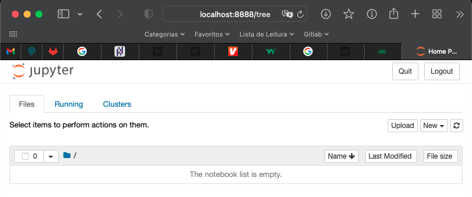

# Instalação e Configuração do Jupyter

## O que é o IPython?

> _O `IPython` é um `interpretador` interativo de várias linguagens, mas com foco em Python, utilizado como ferramenta de `cálculo`e `visualização`._

Ipython oferece _type introspection_, _rich media_, sintax shell, completação por tab e edição auxiliada por histórico de comando ([Wikiepedia](https://pt.wikipedia.org/wiki/IPython)).

Por ser um ambiente interativo facilita o aprendizado da linguagem Python.

## Instalando o IPython

Para instalar o `IPython` basta executar:

```python
pip install ipython
```

## O que é o Jupyter (IPython-notebook)?

> _Jupyter é um plataforma de execução de várias linguagens de programação como `Julia`, `Python` e `R`._

O `Jupyter Notebook` é uma aplicação/interface web que fornece um ambiente de desenvolvimento rico para a plataforma `Jupyter`.

O `Jupyter Notebook` é a evolução do caderno de anotaçòes permitindo que você compile, teste e execute trechos de código de várias linguagens de programação, transformando linhas de texto sem muita vida em gráficos de alta qualidade, de maneira rápida e fácil ([Zoom](https://www.zoom.com.br/pc-computador/deumzoom/jupyter-notebook-o-que-e-como-usar)).

Um documento `Jupyter Notebook` é estruturado formato `JSON`, contendo uma lista ordenada de células de `entrada` e `saída` que podem conter `código`, `texto` (usando `Markdown`), `matemática`, `gráficos` e `texto enriquecido`, geralmente terminando com a extensão `.ipynb` ([Wikepedia](https://pt.wikipedia.org/wiki/Projeto_Jupyter)).

## Como instalar o Jupyter + Jupyter Notebook?

Para instalar o `Jupyter + Notebook` basta executar:

```shell
pip3 install jupyter
```

Para testar a instalação basta executar:

```shell
jupyter notebook
```

A página abaixo será aberta no `navegador` no endereço `http://localhost:8888/tree`:



## Referencias

* https://pt.wikipedia.org/wiki/IPython
* https://www.math.tecnico.ulisboa.pt/~ccal/python/nb01.html
* https://pt.wikipedia.org/wiki/Projeto_Jupyter
* https://www.zoom.com.br/pc-computador/deumzoom/jupyter-notebook-o-que-e-como-usar